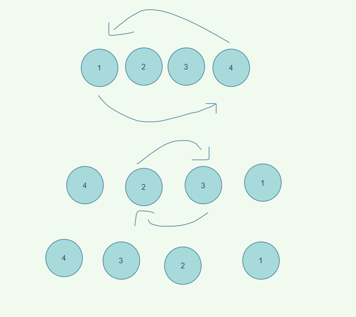

# data-structures-and-algorithms

## Problem domain
I have to reverse any arry without using any built-in method

## Algorithm
we need a variable to act as a holder to hold arr[i], then arr[i] will 
equal to the last index subtracted from the current index, and finally the last index 
subtracted from the current index will equal to the holder's value

## code 

static void reverse (int[] arr)
        {

            int holder = 0;
  
            for (int i = 0; i < arr.Length / 2; i++)
            {
                holder = arr[i];
                arr[i] = arr[arr.Length - 1 - i];
                arr[arr.Length - 1 - i] = holder;
            }
        }

 efficiency: we only needed to itrate half the arry length

## Edge cases

## visual

## Pseudo

## Verification

## Big O