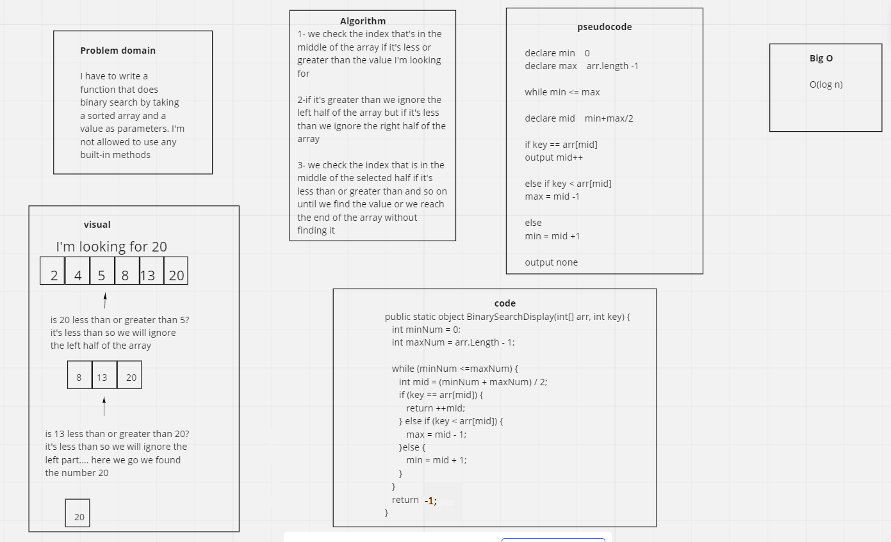

# data-structures-and-algorithms
I have to write a function that does binary search by taking a sorted array and a value as parameters. I'm not allowed to use any built-in methods

efficiency: o(log n)
