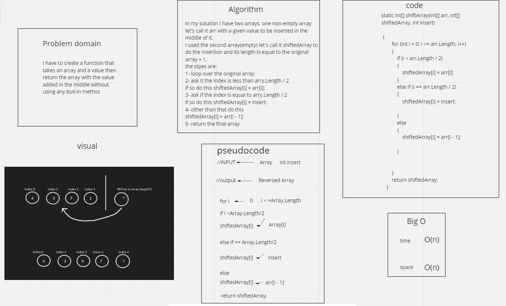

I have to create a function that takes an array and a valuse then return the array with the value added in the middle without using any buil-in methods

efficiency: in terms of speed it's O(n) and in terms of space it's O(n)