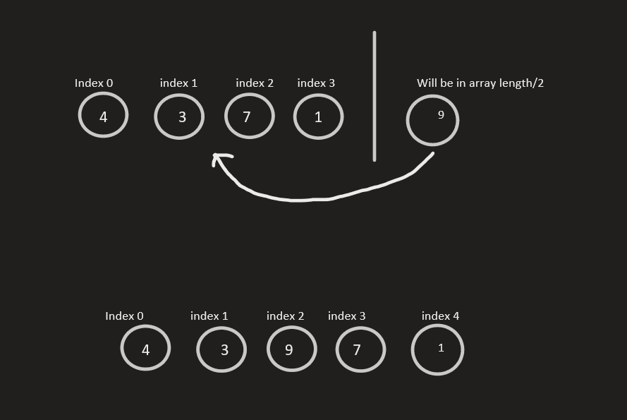

## Problem Domain
I have to create a function that takes an array and a valuse then return the array with the value added in the middle without using any buil-in methos
## Visual

## Algorithm
in my solution I have two arrays.
one non-empty array let's call it arr with a given value to be inserted in the middle of it.

I used the second array(empty) let's call it shiftedArray to do the insertion and its length is equal to the original array + 1.

the stpes are:

1- loop over the original array

2- ask it the index is less than arry.Length / 2

if so do this  shiftedArray[i] = arr[i];

3- ask if the index is equal to arry.Length / 2

if so do this   shiftedArray[i] = insert;

4- other than that do this

shiftedArray[i] = arr[i - 1];

5- return the final array

## Big O

## Pseudocode

## code

       static int[] shiftArray(int[] arr, int[] shiftedArray, int insert)

        {
            for (int i = 0; i <= arr.Length; i++)
            {
                if (i < arr.Length / 2)
                {
                    shiftedArray[i] = arr[i];
                }
                else if (i == arr.Length / 2)
                {
                    shiftedArray[i] = insert;

                }
                else
                {
                    shiftedArray[i] = arr[i - 1];

                }

            }
            return shiftedArray;
        }

## Test